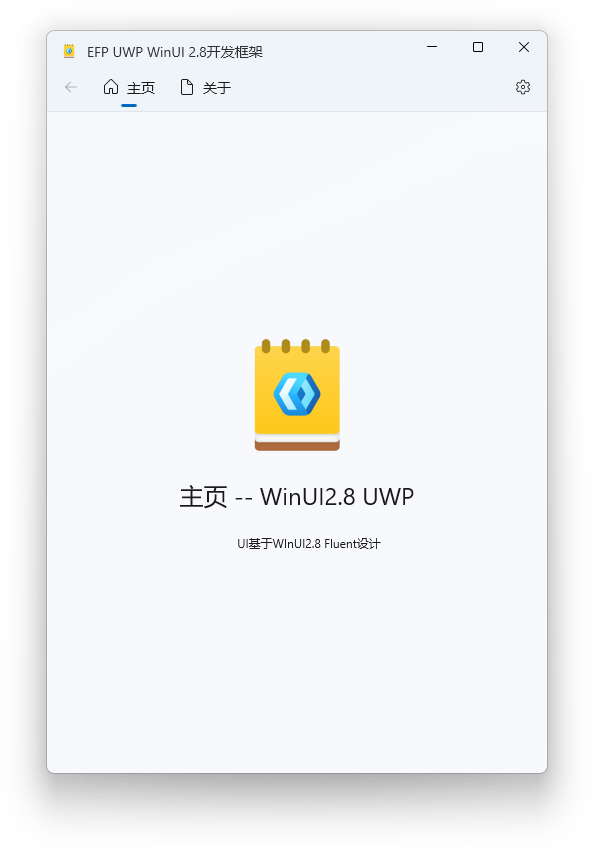
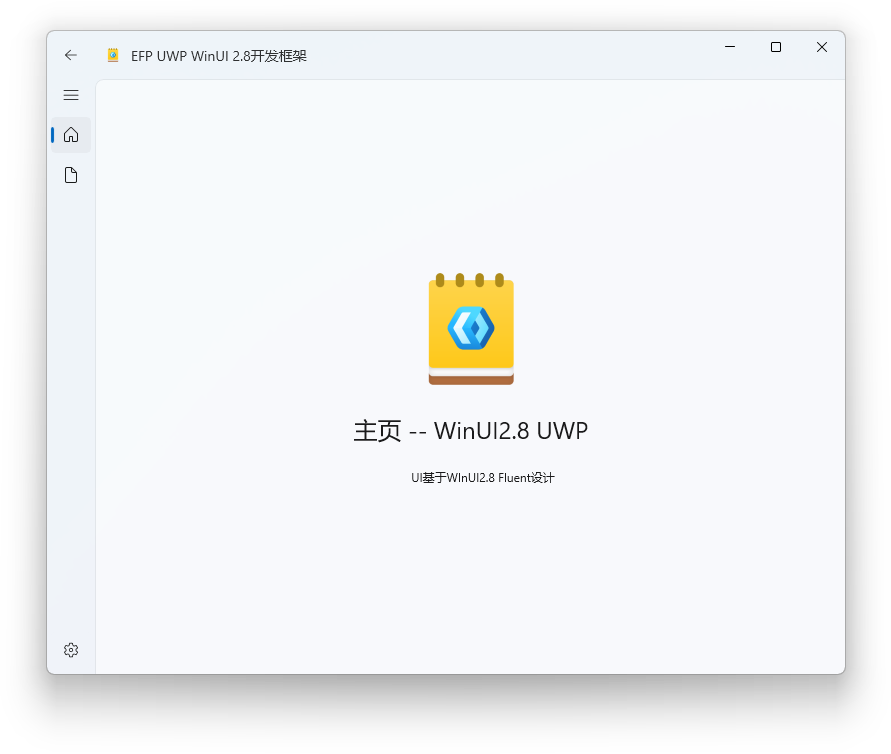

# EFPView

> 一款**完全符合 UWP 与 Fluent Design 设计标准**、**纯原生组件**、**上手即用**，并基于 **WinUI 2.8** 的应用项目模板

---

## ✨ 特色亮点

- **设计规范到位**：全面遵循 UWP 与 Fluent Design 设计规范，视觉与交互一致性强。  
- **纯原生组件**：不依赖第三方 UI 套件，维护与升级更轻量、更稳健。  
- **开箱即用**：克隆即可构建与运行，结构清晰，便于二次开发。  

---

## 📸 界面预览

*样式1*

*样式2*

---

## 🚀 快速开始

- 1、克隆仓库
- 2、打开解决方案（Visual Studio 2022 或更高）
- 3、选择目标体系结构（x86/x64/ARM64），还原依赖并构建
- 4、运行（本地计算机）
